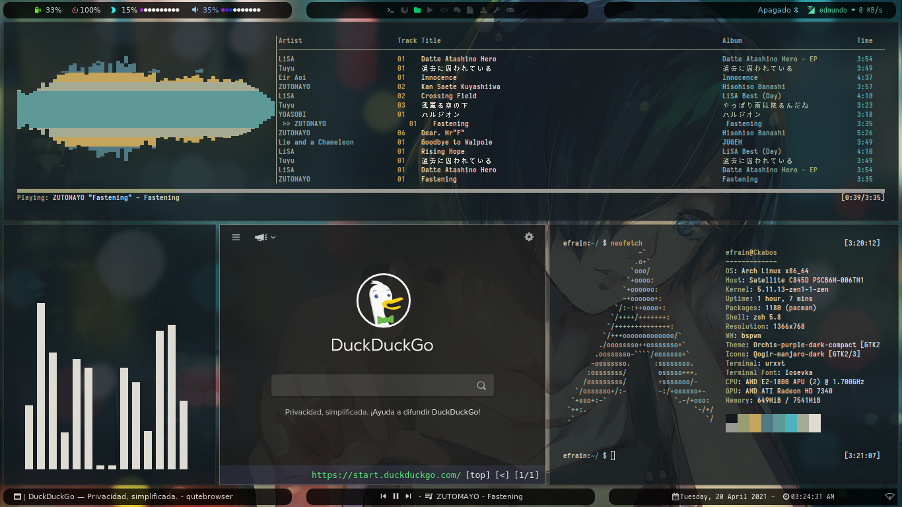

# Bspwm Dotfiles



<!------------------------------------------------------------------------------------------>


### Dependences

- **`Polybar`** : The configuration bars.
- **`Rofi`** : For rofi-bluetooh, rofi launcher and rofi theme selectors.
- **`MPD`** : For audio client with ncmpcpp player.
- **`Bspwm`** : Window Manager.
- **`Sxhkd`** : keybindings.
- **`Nerd Fonts`** : Fonts to the customization.
- **`URxvt`** : Terminal customization with .Xresources file.

### Icon fonts

- **`Material Icons`**
- **`Iosevka Nerd Fonts`**

### Fonts

- **`Source Code Pro Nerd Font`**
- **`Iosevka Nerd Font`**

### Instalation 

- First, clone the repository.

```
$ git clone https://github.com/Ckabos/Bspwm-Dotfiles.git
```

