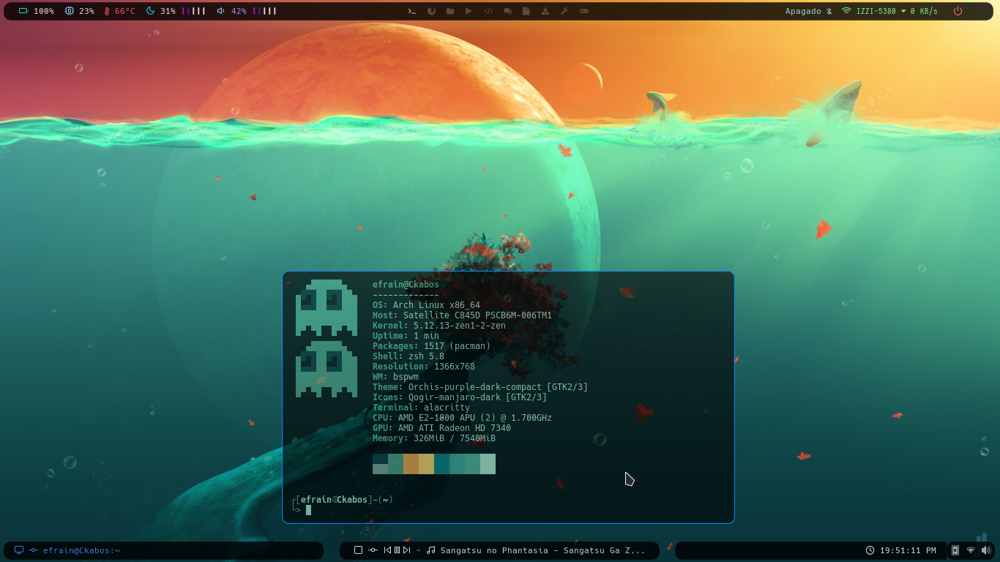

# Bspwm Dotfiles





<!------------------------------------------------------------------------------------------>


### Dependences

- **`Alacritty`** : Terminal
- **`Polybar`** : The configuration bars.
- **`Rofi`** : For rofi-bluetooh, rofi launcher and rofi theme selectors.
- **`MPD`** : For audio client with ncmpcpp player.
- **`ncmpcpp`** : Media Player.
- **`ncmpcpp-ueberzug`** : Displays ncmpcpp album art. 
- **`Bspwm`** : Window Manager.
- **`Sxhkd`** : keybindings.
- **`Nerd Fonts`** : Fonts to the customization.
- **`Feather Fonts`** :  Icon Fonts to the customization.
- **`URxvt`** : Terminal customization with .Xresources file.
- **`Cava`** : Virtualizer Audio.
- **`Picom`** : Picom fork -> [picom-jonaburg-git](https://aur.archlinux.org/packages/picom-jonaburg-git)
- **`playerctl`** : Multimedia Controls with keymap. 
- **`Pactl`** : Control volume with keymap.
- **`pavucontrol`** : GUI Multimedia controls.
- **`i3lock-fancy`** : Session lock.
- **`matescreenshot`** : Screenshot to desktop.
- **`rofi-bluetooth`** : rofi-bluetooth menu.
- **`ranger`** : File manager.

### Icon fonts

- **`Material Icons`**
- **`Iosevka Nerd Fonts`**
- **`Feather Fonts`**

### Fonts

- **`Source Code Pro Nerd Font`**
- **`Iosevka Nerd Font`**
- **`Hack Nerd Font`**
- **`Unifont`**

### Installation 

- First, clone the repository.

```
$ git clone https://github.com/Ckabos/Bspwm-Dotfiles.git
```

- copy the files in the directories appropriate:

```
$ cp -r polybar ~/.config/
$ cp -r dunst ~/.config/
$ cp -r mpd ~/.config/
$ cp -r ncmpcpp ~/.config/
$ cp -r picom ~/.config/
$ cp -r ranger ~/.config/
$ cp -r bspwm ~/.config/
$ cp -r zathura ~/.config/
$ cp -r rofi ~/.config/
$ cp -r alacritty ~/.config/
$ cp -r cava ~/.config/
$ cp -r sxhkd ~/.config/
```
